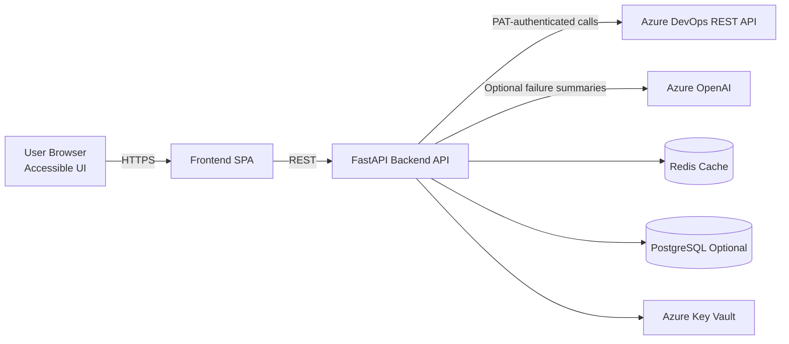

# Architecture & Technology Recommendation

## Recommended Stack

- **Frontend**: React + TypeScript + Vite, with accessible component primitives (e.g., Radix UI or Headless UI).
- **Backend**: FastAPI (Python) for async Azure DevOps API orchestration.
- **Database**: PostgreSQL (optional) for historical snapshots and long-term analytics; Redis for cache/session acceleration.
- **Visualization**: Apache ECharts or Recharts for accessible dashboards with keyboard and ARIA support.
- **AI Layer**: Azure OpenAI (GPT models) behind backend-only integration.
- **Deployment**: Azure Container Apps or AKS + Azure Key Vault + Application Gateway (WAF) + Managed Identity.

## System Architecture Diagram

## Backend Responsibilities

1. Accept org + PAT input and validate connectivity.
2. Encrypt PAT in volatile memory/session store.
3. Fetch projects, pipelines, runs, commits, and build timelines.
4. Compute analytics:
   - Success/failure ratios
   - Build trends over time
   - Code push frequency
   - Error-frequency and failed-task hotspots
5. Return AI summaries when failures exist and AI is configured.

## Accessibility Strategy

- Keyboard-only operation for all controls.
- Semantic landmarks (`header`, `main`, `section`, `nav`).
- High-contrast color palette and visible focus states.
- `aria-live` regions for async status updates.
- Tables/charts always include textual summaries.

## Security Design

- Never persist PAT in frontend local/session storage.
- Encrypt PAT server-side with `Fernet` using `APP_ENCRYPTION_KEY`.
- Redact sensitive headers from logs.
- Add per-IP rate limiting and API gateway policies for production.

## Scalability & Reliability

- Async HTTP client for Azure DevOps fanout.
- Short TTL response cache for expensive analytics endpoints.
- Graceful partial-failure handling (return available data and diagnostics).
- Worker offloading for heavy aggregation if scale increases.
